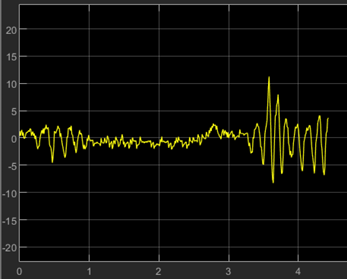

# Furuta Pendulum: LQR-Based Real-Time Control with Hardware-in-the-Loop

This repository contains a complete implementation of a control system for a **Furuta Pendulum** (rotary inverted pendulum) using MATLAB/Simulink and an ESP32-based hardware setup. The project focuses on modeling, simulation, control design (LQR), and real-time validation via Hardware-in-the-Loop (HIL) testing.

> 📍 Developed as part of the *Hybrid Control Systems (MCT411s)* course  
> 🏫 Faculty of Engineering, Ain Shams University

---

## 📽️ Demo
👉 [Watch System Demo & Documentation](https://drive.google.com/file/d/1tvSFMBx72GJj9IXAS10luPX_5w33Nhrb/view?usp=drive_link)

---

## 🧠 Project Overview

The **Furuta Pendulum** is a nonlinear, underactuated system used extensively to test advanced control strategies. This project demonstrates:

- Stabilization of the pendulum in the upright position
- Disturbance rejection and robust performance
- Full integration from simulation to hardware execution

---

## 📌 Features

- ✅ **Dynamic System Modeling** (State-space)
- ✅ **Parameter Estimation** using CAD & experiments
- ✅ **LQR Controller Design** via MATLAB `lqr()` function
- ✅ **Simulink Simulation** of complete system dynamics
- ✅ **Hardware-in-the-Loop (HIL)** with ESP32 & encoders
- ✅ **Disturbance Rejection Testing**
- ✅ **Comprehensive Analysis & Plots**

---

## 🛠️ Hardware Components

- DC Motor with Encoder
- ESP32 Microcontroller
- H-Bridge Driver
- Breadboard & Power Supply
- Mechanical Pendulum Assembly (3D-printed or machined)

---

## 🧰 Software Stack

- MATLAB / Simulink
- Embedded C (for ESP32 via Arduino IDE or ESP-IDF)
- SolidWorks (for mechanical design & parameter extraction)

---

## 📈 Control Approach

We use a **Linear Quadratic Regulator (LQR)** to minimize the following cost function:

\[
J = \int (x^T Q x + u^T R u) dt
\]

Where:

- `Q`: Weight matrix penalizing state deviations  
- `R`: Weight matrix penalizing control effort  
- `K`: Feedback gain matrix computed via `lqr(A, B, Q, R)`  

The control law is:  
\[
u = -Kx
\]

---

## 📊 Results

- ✔️ Pendulum stabilizes quickly at upright position
- ✔️ System responds robustly to external disturbances
- ✔️ HIL test matches simulation performance

---

## ⚠️ Challenges Faced

- Dead zones & hysteresis in the motor
- Backlash in mechanical joints
- Parameter mismatch between simulation and real system
- Fine-tuning LQR weight matrices for optimal performance

---

## 👨‍💻 Authors

- Mahmoud Yasser Mahmoud – [@mahmoudyasser32](https://github.com/mahmoudyasser32)  

---

## 📂 Files Structure (Suggested)

